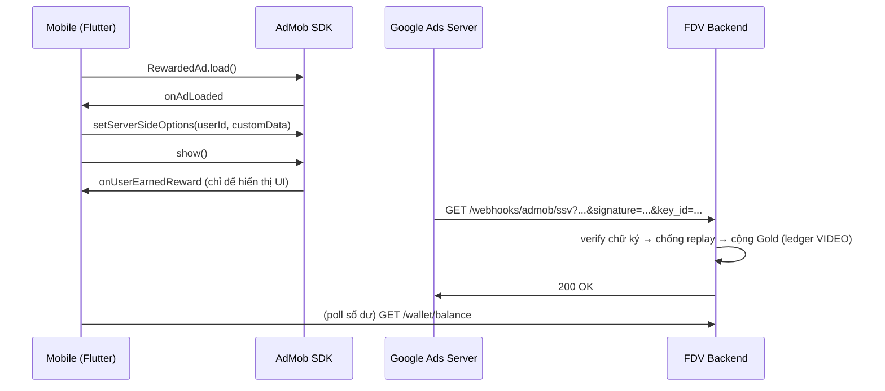

# AdMob Rewarded Ads — Server-Side Verification (SSV)

Tài liệu tích hợp thưởng Gold cho lượt xem rewarded video, và cách xác thực lượt xem bằng SSV.

## URL callback

```
https://backend.fandomvote.com/api/v1/webhooks/admob/ssv
```

- Method: **GET** (AdMob luôn gọi GET)
- Không cần JWT (`@Public()`) — xác thực bằng **chữ ký số của Google**, không bằng token
- Dán URL này vào **từng ad unit** trong AdMob console → *Ad unit → Server-side verification → Callback URL*

## SSV là gì và vì sao cần

Sau khi user xem hết quảng cáo, AdMob gọi trực tiếp vào URL trên kèm các tham số **có chữ ký của Google**. Backend verify chữ ký → biết chắc lượt xem là thật rồi mới cộng Gold.

Không có SSV thì chỉ còn cách tin client nói *"tôi xem xong rồi"*; app bị mod có thể gọi API nhận Gold mà không xem gì. Vì tiền đi qua đây nên SSV là đường duy nhất đáng tin (§0.6 — luôn verify trước khi cộng tiền).

## Luồng



Điểm quan trọng: `onUserEarnedReward` phía client **chỉ dùng để hiển thị**, không phải căn cứ cộng tiền.

## Tham số AdMob gửi

| Tham số | Ý nghĩa |
|---|---|
| `ad_network` | ID mạng quảng cáo |
| `ad_unit` | ID ad unit |
| `reward_amount`, `reward_item` | Phần thưởng khai báo ở ad unit (**không dùng để tính Gold**) |
| `timestamp` | Thời điểm (millisecond) |
| `transaction_id` | ID lượt xem — dùng làm khoá chống replay |
| `user_id` | Do client gắn qua `ServerSideVerificationOptions` |
| `custom_data` | Chuỗi tuỳ ý do client gắn |
| `signature` | Chữ ký ECDSA (DER, base64url) |
| `key_id` | ID public key để verify |

`signature` và `key_id` **luôn là 2 tham số cuối**.

## Cách verify (đã cài trong code)

Code: [`backend/src/modules/webhook/admob-ssv.service.ts`](../backend/src/modules/webhook/admob-ssv.service.ts)

1. **Tách phần được ký** = query string thô từ tham số đầu đến **ngay trước `&signature=`**.
   Lấy từ `req.originalUrl` — *không* parse rồi ghép lại, vì chữ ký tính trên đúng chuỗi byte đó (đổi thứ tự hoặc encode lại là verify sai).
   `signature` cũng đọc từ chuỗi thô: `URLSearchParams` biến `+` thành khoảng trắng, làm hỏng base64.
2. **Verify ECDSA-SHA256** với public key lấy theo `key_id` từ
   `https://www.gstatic.com/admob/reward/verifier-keys.json`
   (JSON dạng `keys: [{ keyId, pem, base64 }]`; hiện có 1 key, `keyId=3335741209`).
   Public key **cache 24h**, và tải lại ngay khi gặp `key_id` lạ (Google có xoay key).
3. **Chống callback cũ**: `timestamp` lệch quá **1 giờ** → từ chối.
4. **Kiểm `user_id`**: phải đúng định dạng UUID (chặn rác trước khi query DB) và phải là user tồn tại.
5. **Cộng Gold**: `AdRewardService.creditFromSsv()` — `admob-ssv:<transaction_id>` làm idempotency key.
   Gọi lại cùng `transaction_id` → trả kết quả cũ, **không cộng thêm**.

### Mã lỗi endpoint trả về

| Code | Nguyên nhân |
|---|---|
| `SSV_MALFORMED` | thiếu `signature` / `key_id` / `transaction_id`, hoặc `user_id` sai định dạng |
| `SSV_KEY_UNKNOWN` | `key_id` không có trong danh sách key của Google |
| `SSV_KEYS_FETCH_FAILED` | không tải được `verifier-keys.json` |
| `SSV_SIGNATURE_INVALID` | chữ ký không hợp lệ (giả mạo hoặc tính sai phần được ký) |
| `SSV_STALE` | callback quá hạn 1 giờ |
| `NOT_FOUND` | `user_id` không tồn tại |
| `AD_DAILY_CAP` | user đã đạt trần lượt/ngày |
| `AD_REWARD_DISABLED` | trần hoặc Gold/lượt bằng 0 |

## Công thức Gold

```
Gold mỗi lượt = giá 1 lượt xem (VND) × tỉ lệ trả về
1 Gold = 1đ (giống offerwall)
```

Ví dụ: giá `200`đ, tỉ lệ `100%` → user nhận **200 Gold**. Tỉ lệ `50%` → 100 Gold (giữ lại 50%).

Ledger ghi `source = VIDEO` → tự động tính vào mốc referral 500 Gold và bảng xếp hạng TOP_EARNER, giống các nguồn earn khác.

### Config (bảng `platform_config`, sửa trong Admin → Shop & Deals)

| Key | Mặc định | Ý nghĩa |
|---|---|---|
| `ads.reward_value_vnd` | `200` | Giá 1 lượt xem (VND) |
| `ads.reward_ratio_bps` | `10000` | Tỉ lệ trả về user (bps; `10000` = 100%) |
| `ads.daily_view_cap` | `10` | Trần lượt được thưởng mỗi ngày (UTC+7). `0` = tắt |
| `ads.cooldown_seconds` | `30` | Giãn cách tối thiểu giữa 2 lượt (**chỉ áp cho đường client**) |
| `ads.ssv_enabled` | `false` | `true` = chỉ cộng Gold qua SSV |

Giá 1 lượt hiện **nhập tay**. Kế hoạch: lấy tự động từ **eCPM ngày hôm trước** qua AdMob Reporting API và ghi vào `ads.reward_value_vnd` bằng một cron — không cần sửa chỗ nào khác.

## Hai đường cộng Gold

| Đường | Endpoint | Tin cậy | Guard |
|---|---|---|---|
| Client báo đã xem | `POST /shop/ads/reward` | ⚠️ tin client | trần/ngày, cooldown, Idempotency-Key, chặn user flag |
| **SSV (khuyến nghị)** | `GET /webhooks/admob/ssv` | ✅ chữ ký Google | trần/ngày, `transaction_id` chống replay |

Bật `ads.ssv_enabled = true` → `POST /shop/ads/reward` trả lỗi `AD_SSV_ONLY`, nên **không thể cộng 2 lần**.

SSV **không áp cooldown** (có chủ đích): lượt xem đã được Google xác thực, chặn ở đó user mất Gold oan. Trần/ngày vẫn áp.

## Bật SSV — checklist

1. **AdMob console**: tạo ad unit thật → dán callback URL ở đầu tài liệu vào *Server-side verification*.
2. **Mobile**: [`mobile/lib/core/ad_config.dart`](../mobile/lib/core/ad_config.dart)
   - `creditGoldAfterView = true`
   - `useTestAds = false` + dán ad unit ID thật vào các hằng `_prod...`
   - Cập nhật App ID thật ở `AndroidManifest.xml` (`com.google.android.gms.ads.APPLICATION_ID`) và `ios/Runner/Info.plist` (`GADApplicationIdentifier`)
3. **Backend**: `ads.ssv_enabled = true`
   ```sql
   UPDATE platform_config SET value = 'true'::jsonb, updated_at = NOW() WHERE key = 'ads.ssv_enabled';
   ```
4. Xem 1 quảng cáo thật → kiểm log `AdmobSSV` và một dòng ledger mới `source=VIDEO`, `ref_type=admob-ssv`.

## Test

**Smoke test (an toàn, chạy được ngay)** — chữ ký rác phải bị từ chối:

```bash
curl -i "https://backend.fandomvote.com/api/v1/webhooks/admob/ssv?ad_network=1&ad_unit=1&reward_amount=1&reward_item=coins&timestamp=1700000000000&transaction_id=smoke-test&user_id=550e8400-e29b-41d4-a716-446655440000&signature=AAAA&key_id=3335741209"
```

Kỳ vọng: lỗi `SSV_SIGNATURE_INVALID` (nếu route sai sẽ là 404) → chứng tỏ endpoint sống và verify đang chạy.

**Giới hạn**: AdMob **không gọi callback cho test ad unit của Google** (mục cấu hình SSV chỉ có trên ad unit thuộc tài khoản của bạn). Vì vậy trước khi có ad unit thật, chỉ verify được phần crypto bằng chữ ký tự dựng — đã kiểm bằng keypair EC P-256 tự sinh: chữ ký hợp lệ được nhận; sửa `reward_amount`, đổi `user_id`, hoặc thiếu `signature` đều bị chặn.

## Giới hạn bảo mật đã biết

**SSV chứng minh "có người xem quảng cáo thật", không chứng minh "ai xem"** — `user_id` do client gắn, Google chỉ chuyển tiếp nguyên văn. Client bị mod có thể ghi `user_id` của tài khoản khác (tặng Gold cho người khác, không tự làm giàu).

Cách bịt khi cần: server phát một **nonce** dùng một lần, client gắn vào `customData`, backend đối chiếu nonce ↔ user rồi vô hiệu hoá nonce. Chưa cài.

## Troubleshooting

**Không tải được quảng cáo, `code=5` (`GADErrorTimeout`)** — thường là mạng/DNS của máy dev, không phải lỗi code. Đã gặp: DNS máy chỉ trả bản ghi IPv6 cho `googleads.g.doubleclick.net` trong khi máy không có route IPv6 mặc định → SDK không resolve được, còn `dig` tới thẳng DNS server thì IPv4 vẫn có.

```bash
# 1. Xoá cache DNS
sudo dscacheutil -flushcache && sudo killall -HUP mDNSResponder
# 2. Kiểm resolver hệ thống (cái mà simulator dùng) — phải có ipv4_address
dscacheutil -q host -a name googleads.g.doubleclick.net
# 3. Kiểm đường mạng, bỏ qua resolver — connect/tls phải thành công
curl -sS -o /dev/null -w "code=%{http_code} connect=%{time_connect}s tls=%{time_appconnect}s\n" \
  --resolve googleads.g.doubleclick.net:443:172.217.194.156 https://googleads.g.doubleclick.net/mads/gma
```

Nếu vẫn lỗi: tắt VPN (DNS split-horizon hay chặn domain quảng cáo), hoặc đổi DNS máy sang `8.8.8.8`/`1.1.1.1`, hoặc thử hotspot 4G / thiết bị thật.

**Các mã lỗi load ads khác**: `0` internal · `1` invalid request (sai ad unit / App ID không khớp) · `2` network · `3` no fill (không có quảng cáo trả về).

## Code liên quan

| File | Vai trò |
|---|---|
| [`backend/src/modules/webhook/admob-ssv.service.ts`](../backend/src/modules/webhook/admob-ssv.service.ts) | Verify chữ ký + chống replay |
| [`backend/src/modules/webhook/webhook.controller.ts`](../backend/src/modules/webhook/webhook.controller.ts) | Route `GET /webhooks/admob/ssv` |
| [`backend/src/modules/shop/ad-reward.service.ts`](../backend/src/modules/shop/ad-reward.service.ts) | Tính Gold, trần/ngày, cộng ledger, config |
| [`mobile/lib/core/ad_config.dart`](../mobile/lib/core/ad_config.dart) | Ad unit ID (test/prod), cờ `creditGoldAfterView` |
| [`mobile/lib/features/shop/widgets/reward_ad_card.dart`](../mobile/lib/features/shop/widgets/reward_ad_card.dart) | Load/show ads, gắn `ServerSideVerificationOptions` |
| [`web/src/features/admin/ad-reward-config-card.tsx`](../web/src/features/admin/ad-reward-config-card.tsx) | Admin sửa giá lượt xem + tỉ lệ |
